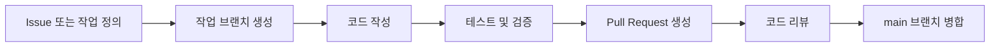

<div align="center">

# Digital Lab

### Crop Production & Physiology Division

### National Institute of Crop Science, RDA

<br>


<br>

**식량과학원 재배생리과 디지털연구실 GitHub Organization**

연구 코드의 체계적인 관리와 협업,
그리고 재현 가능한 연구 환경 구축을 목적으로 운영합니다.

</div>

---

## About

Digital Lab GitHub Organization은 다음 목적을 위해 운영됩니다.

* 연구 프로젝트 코드의 버전 관리
* 연구자 간 코드 공유 및 협업
* 분석 및 실험 과정의 재현성 확보
* 공통 연구 도구와 문서의 체계적인 관리

> GitHub에서는 코드와 연구 재현에 필요한 설정 및 실행 스크립트만 관리합니다.
> 원본 데이터, 대용량 데이터셋, 모델 가중치 등은 별도의 스토리지에서 관리합니다.

---

## Quick Navigation

| 문서                                             | 설명                    |
| :--------------------------------------------- | :-------------------- |
| [Organization Rules](#organization-rules)      | Organization 공통 운영 규칙 |
| [Repository Policy](#repository-policy)        | 저장소 생성 및 관리 기준        |
| [Repository Types](#repository-types)          | 저장소 목적별 분류            |
| [Branch Convention](#branch-naming-convention) | 브랜치 이름 규칙             |
| [README Template](#repository-readme-template) | 신규 저장소 README 작성 기준   |
| [.gitignore Policy](#basic-gitignore-policy)   | 필수 제외 파일 정책           |
| [Contribution Guide](#contribution-guide)      | 코드 기여 및 PR 절차         |
| [Administrators](#administrators)              | Organization 관리자 정보   |

---

## Organization Rules

모든 Repository는 다음 규칙을 준수해야 합니다.

| 구분     | 필수 정책                            |
| :----- | :------------------------------- |
| 문서화    | 모든 Repository에 `README.md` 포함    |
| 제외 파일  | 프로젝트 환경에 맞는 `.gitignore` 적용      |
| 데이터 관리 | 데이터셋 및 대용량 파일 업로드 금지             |
| 협업 방식  | Pull Request 기반 코드 검토 및 병합       |
| 브랜치 관리 | `main` 브랜치 직접 Push 지양            |
| 보안     | 비밀번호, API Key, 인증서 등 민감정보 업로드 금지 |

> [!IMPORTANT]
> `.env`, API Key, 비밀번호, 개인 인증서, 서버 접속 정보 등은 GitHub에 업로드하면 안 됩니다.

> [!WARNING]
> 원본 이미지, 영상, 데이터셋, 학습 모델, 모델 가중치는 별도의 데이터 저장소에서 관리해야 합니다.

---

## Repository Policy

### 기본 원칙

1. GitHub에는 연구 코드와 재현에 필요한 설정 파일만 업로드합니다.
2. 데이터셋과 대용량 파일은 별도의 저장소에서 관리합니다.
3. 모든 Repository에는 프로젝트 목적과 실행 방법을 설명하는 `README.md`를 작성합니다.
4. 언어와 개발 환경에 적합한 `.gitignore`를 적용합니다.
5. 변경사항은 별도 브랜치에서 개발한 후 Pull Request를 통해 병합합니다.
6. 연구 결과에 영향을 주는 설정값은 코드 또는 설정 파일로 기록합니다.
7. 재현에 필요한 라이브러리 버전을 `requirements.txt`, `pyproject.toml` 등의 파일로 관리합니다.

### 업로드 가능한 항목

* 연구 및 분석 코드
* 데이터 전처리 스크립트
* 학습 및 추론 스크립트
* 실험 설정 파일
* 환경 구성 파일
* 소규모 예제 데이터
* 문서 및 연구 재현 가이드
* 데이터 다운로드 또는 연동 스크립트

### 업로드 금지 항목

* 원본 연구 데이터
* 개인정보가 포함된 파일
* 대용량 이미지 및 영상
* 데이터베이스 덤프
* 모델 가중치
* API Key 및 비밀번호
* 서버 인증서 및 개인키
* 빌드 결과물 및 임시 파일

---

## Repository Types

Repository는 목적에 따라 다음과 같이 분류합니다.

| Type      | 목적                | 예시               |
| :-------- | :---------------- | :--------------- |
| `project` | 개별 연구 프로젝트 코드     | 작물 생육 분석, 이미지 분류 |
| `tools`   | 데이터 처리 및 공통 실험 도구 | 이미지 전처리, CSV 변환  |
| `web`     | 연구 결과 시각화 및 서비스   | 대시보드, 분석 결과 조회   |
| `docs`    | 연구실 공통 문서 및 가이드   | 개발 환경 설정, 운영 규칙  |

### 권장 Repository 이름

```text
project-crop-growth-analysis
tools-image-preprocessing
web-research-dashboard
docs-development-guide
```

Repository 이름은 다음 기준을 권장합니다.

* 영문 소문자 사용
* 단어 구분은 하이픈(`-`) 사용
* 프로젝트 목적이 드러나는 이름 사용
* 개인 이름이나 의미가 불분명한 약어 사용 지양

---

## Branch Naming Convention

| 브랜치            | 용도           | 예시                           |
| :------------- | :----------- | :--------------------------- |
| `main`         | 검증된 안정 버전    | `main`                       |
| `dev`          | 개발 통합 브랜치    | `dev`                        |
| `feat/*`       | 신규 기능 개발     | `feat/data-loader`           |
| `fix/*`        | 버그 수정        | `fix/csv-parse-error`        |
| `refactor/*`   | 구조 개선 및 리팩터링 | `refactor/training-pipeline` |
| `docs/*`       | 문서 수정        | `docs/update-installation`   |
| `experiment/*` | 실험적 기능 또는 분석 | `experiment/yolo-v11`        |

### 브랜치 이름 작성 원칙

```text
유형/작업-내용
```

예시:

```text
feat/image-segmentation
fix/missing-value-processing
docs/add-training-guide
experiment/change-learning-rate
```

---

## Pull Request Policy

Pull Request에는 다음 내용을 포함하는 것을 권장합니다.

### 필수 작성 항목

* 변경 목적
* 주요 변경사항
* 실행 또는 검증 방법
* 연구 결과에 미치는 영향
* 관련 Issue 또는 실험 ID

### Pull Request 예시

```markdown
## 변경 목적

벼 생육 이미지 전처리 과정에 자동 밝기 보정 기능을 추가했습니다.

## 주요 변경사항

- CLAHE 기반 밝기 보정 기능 추가
- 전처리 설정 파일 분리
- 테스트 이미지 처리 스크립트 추가

## 검증 방법

python scripts/preprocess.py \
  --config configs/preprocess.yaml \
  --input samples/example.jpg

## 관련 정보

- Experiment ID: EXP-2024-001
- Related Issue: #12
```

> [!NOTE]
> 단순 문서 수정이 아닌 경우, Pull Request 본문에 실행 또는 검증 방법을 기록해야 합니다.

---

## Repository README Template

신규 Repository를 생성할 때 다음 구조를 기본 템플릿으로 사용합니다.

<details>
<summary><strong>README 템플릿 보기</strong></summary>

<br>

````markdown
# Project Name

프로젝트의 목적과 주요 기능을 2~3줄로 설명합니다.


---

## Overview

프로젝트의 연구 배경, 해결하려는 문제, 주요 처리 과정을 설명합니다.

| 항목 | 내용 |
| :--- | :--- |
| 담당자 | 이름 / 이메일 |
| 연구 기간 | 2024.03 ~ 2025.02 |
| 프로젝트 상태 | 진행 중 / 완료 / 보관 |
| 관련 실험 ID | EXP-2024-001 |
| 관련 데이터 | 별도 데이터 저장소 경로 |

---

## Key Features

- 주요 기능 1
- 주요 기능 2
- 주요 기능 3

---

## Results

실험 결과와 주요 성능 지표를 기록합니다.

| 모델 | 데이터셋 | 성능 | 비고 |
| :--- | :--- | ---: | :--- |
| YOLOv8 | rice-2024 | 92.3% | 최종 모델 |
| ResNet50 | rice-2024 | 89.7% | 비교 모델 |

> 자세한 실험 조건과 평가 기준은 `docs/experiment-results.md`를 참고하세요.

---

## Directory Structure

```text
project-name/
├── src/            # 핵심 소스 코드
├── configs/        # 실험 및 실행 설정
├── scripts/        # 학습, 추론, 전처리 스크립트
├── notebooks/      # 분석용 Jupyter Notebook
├── experiments/    # 실험 로그 및 메타데이터
├── tests/          # 테스트 코드
├── docs/           # 프로젝트 문서
├── requirements.txt
├── .gitignore
└── README.md
```

> `experiments/`에는 소규모 로그와 설정값만 저장합니다.  
> 모델 가중치와 대용량 결과 파일은 별도 스토리지에서 관리합니다.

---

## Installation

### Requirements

- Python 3.10 이상
- Git
- 프로젝트별 추가 시스템 패키지

### 1. Repository 복사

```bash
git clone https://github.com/lab-org/project-name.git
cd project-name
```

### 2. 가상환경 생성

#### Windows

```powershell
python -m venv .venv
.venv\Scripts\activate
```

#### macOS / Linux

```bash
python3 -m venv .venv
source .venv/bin/activate
```

### 3. 라이브러리 설치

```bash
python -m pip install --upgrade pip
pip install -r requirements.txt
```

---

## Usage

### 학습

```bash
python scripts/train.py \
  --config configs/default.yaml
```

### 추론

```bash
python scripts/predict.py \
  --config configs/default.yaml \
  --input path/to/image.jpg
```

### 테스트

```bash
pytest
```

---

## Configuration

주요 설정 파일:

```text
configs/
├── default.yaml
├── train.yaml
└── inference.yaml
```

설정값 변경 시 실험 결과의 재현을 위해 사용한 설정 파일을 함께 기록합니다.

---

## Related Data

이 프로젝트에서 사용하는 데이터는 GitHub 외부에서 관리합니다.

| 항목 | 내용 |
| :--- | :--- |
| 실험 ID | EXP-2024-001 |
| 데이터 경로 | `/data/lab/crops/rice/2024/` |
| 데이터 유형 | 벼 생육 이미지 |
| 데이터 규모 | 이미지 12,000장 |
| 수집 방식 | 드론 촬영 |

> 데이터 접근 권한은 프로젝트 담당자 또는 Organization 관리자에게 문의하세요.

---

## Reproducibility

연구 결과 재현을 위해 다음 정보를 기록합니다.

- Python 버전
- 라이브러리 버전
- 데이터 버전 또는 실험 ID
- 실행 설정 파일
- Random Seed
- 학습 장비 및 환경
- 평가 지표와 평가 방법

환경 정보 저장 예시:

```bash
pip freeze > requirements-lock.txt
```

---

## Contributing

1. 작업 브랜치를 생성합니다.
2. 기능을 구현하거나 문제를 수정합니다.
3. 테스트 및 실행 검증을 수행합니다.
4. 변경사항을 Commit합니다.
5. Pull Request를 생성합니다.
6. 관리자 검토 후 `main` 브랜치에 병합합니다.

```bash
git checkout -b feat/feature-name
git add .
git commit -m "feat: add feature description"
git push origin feat/feature-name
```

---

## Contact

| 역할 | 이름 | 연락처 |
| :--- | :--- | :--- |
| 개발 담당 | 이름 | example@korea.kr |
| 데이터 담당 | 이름 | example@korea.kr |
````

</details>

---

## Basic `.gitignore` Policy

다음 항목은 모든 Repository의 `.gitignore`에 기본적으로 포함해야 합니다.

<details>
<summary><strong>기본 .gitignore 보기</strong></summary>

<br>

```gitignore
# =========================================================
# Operating System
# =========================================================
.DS_Store
Thumbs.db
Desktop.ini

# =========================================================
# Python
# =========================================================
__pycache__/
*.py[cod]
*$py.class
.pytest_cache/
.mypy_cache/
.ruff_cache/
.coverage
htmlcov/

# =========================================================
# Virtual Environment
# =========================================================
.venv/
venv/
env/
ENV/

# =========================================================
# Environment Variables and Secrets
# =========================================================
.env
.env.*
!.env.example
*.pem
*.key
credentials.json
secrets.json

# =========================================================
# Jupyter Notebook
# =========================================================
.ipynb_checkpoints/

# =========================================================
# Logs and Temporary Files
# =========================================================
*.log
logs/
tmp/
temp/
.cache/

# =========================================================
# Dataset
# =========================================================
data/
dataset/
datasets/
raw_data/
processed_data/

# =========================================================
# Model Weights and Large Artifacts
# =========================================================
*.pt
*.pth
*.ckpt
*.onnx
*.h5
*.joblib
*.pkl

# =========================================================
# Experiment Outputs
# =========================================================
runs/
outputs/
results/
artifacts/
checkpoints/
wandb/

# =========================================================
# Build
# =========================================================
dist/
build/
*.egg-info/

# =========================================================
# IDE
# =========================================================
.vscode/
.idea/
*.code-workspace
```

</details>

### 예외 처리 원칙

모델 가중치나 예제 데이터가 반드시 필요한 경우 다음 조건을 모두 확인해야 합니다.

1. 관리자와 사전 협의
2. 라이선스 및 개인정보 검토
3. 파일 크기 확인
4. Git LFS 사용 여부 검토
5. README에 파일 목적과 출처 명시

---

## Contribution Guide

Pull Request는 코드 변경사항을 다른 구성원이 검토한 후 반영하는 협업 방식입니다.



### 기본 작업 절차

```bash
# 최신 코드 가져오기
git checkout main
git pull origin main

# 작업 브랜치 생성
git checkout -b feat/feature-name

# 변경사항 Commit
git add .
git commit -m "feat: add feature description"

# 원격 Repository에 Push
git push origin feat/feature-name
```

이후 GitHub에서 Pull Request를 생성하고 관리자 검토를 요청합니다.

### Commit Message 권장 형식

| 유형         | 설명          | 예시                                    |
| :--------- | :---------- | :------------------------------------ |
| `feat`     | 신규 기능       | `feat: add image preprocessing`       |
| `fix`      | 버그 수정       | `fix: handle missing csv values`      |
| `docs`     | 문서 변경       | `docs: update installation guide`     |
| `refactor` | 코드 구조 개선    | `refactor: separate training service` |
| `test`     | 테스트 추가 및 수정 | `test: add preprocessing tests`       |
| `chore`    | 설정 및 기타 작업  | `chore: update dependencies`          |

---

## Administrators

Organization 설정, Repository 생성, 멤버 권한 또는 운영 정책에 관한 문의는 관리자에게 연락하세요.

| 역할    | 이름  | 연락처                                             |
| :---- | :-- | :---------------------------------------------- |
| 민간전문가 | 김형균 | [khgyun09@gmail.com](mailto:khgyun09@gmail.com) |
| 농업연구사 | 권동원 | [echo825@korea.kr](mailto:echo825@korea.kr)     |

### 관리자 권한

* Organization 설정 관리
* Repository 생성 및 보관
* 멤버 초대 및 권한 관리
* Branch Protection Rule 관리
* Pull Request 검토 및 병합
* 보안 및 데이터 정책 관리

---

## Recommended Repository Settings

신규 Repository 생성 시 다음 설정을 권장합니다.

| 설정                | 권장값                 |
| :---------------- | :------------------ |
| 기본 브랜치            | `main`              |
| Branch Protection | 활성화                 |
| Pull Request 승인   | 최소 1명               |
| Force Push        | 비활성화                |
| Branch 삭제         | PR 병합 후 자동 삭제       |
| Issues            | 활성화                 |
| Discussions       | 프로젝트 필요 시 활성화       |
| Wiki              | 별도 문서 저장소 사용 시 비활성화 |
| Secret Scanning   | 사용 가능한 경우 활성화       |

### `main` 브랜치 보호 권장 항목

* Pull Request 없이 병합 금지
* 최소 1명 이상의 승인 필요
* 승인 이후 변경 발생 시 재승인
* Force Push 금지
* 브랜치 삭제 금지

---

## Contact

Organization 운영과 관련된 문의는 아래 관리자에게 연락하세요.

| 역할    | 이름  | 연락처                                             |
| :---- | :-- | :---------------------------------------------- |
| 민간전문가 | 김형균 | [khgyun09@gmail.com](mailto:khgyun09@gmail.com) |
| 농업연구사 | 권동원 | [echo825@korea.kr](mailto:echo825@korea.kr)     |

---

<div align="center">

**Digital Lab · Crop Production & Physiology Division · RDA**

Research Code · Collaboration · Reproducibility

</div>
